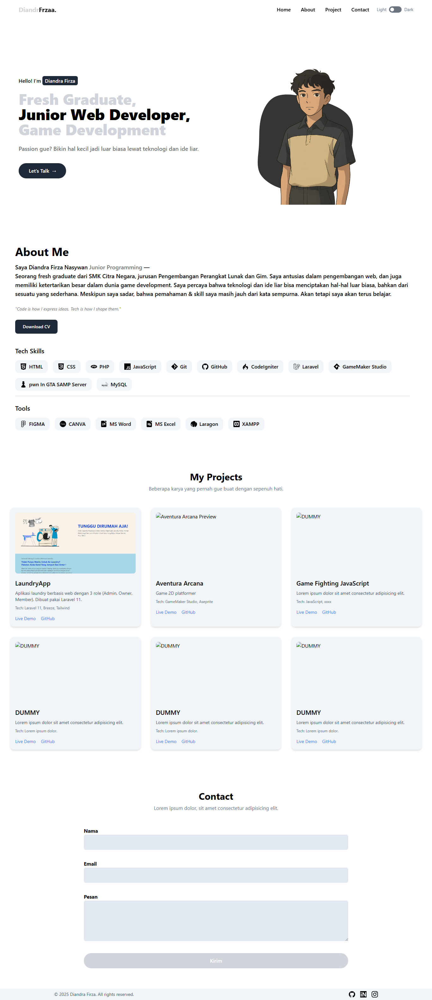

# 🌐 Portfolio Website - DiandrFrzaa

Ini adalah website portofolio pribadi sederhana (versi frontend) yang dibuat menggunakan:
- ⚡ HTML
- 🎨 Tailwind CSS
- 🧠 JavaScript

## 🚀 Fitur Utama
- Responsive layout (mobile-friendly)
- Dark/Light mode toggle (BETA)
- Sticky navbar
- Hamburger menu untuk mobile view

## 📂 Struktur Folder

```
.
├── index.html
├── assets/
│        └── img/
│              └── icon/
|                      └── (gambar)
|              └── project/
|                      └── (gambar)
|        └── css/
|               └── style.css
|        └── js/
|               └── script.js

```

## 🛠️ Cara Menjalankan
1. Clone repository:
   ```bash
   git clone https://github.com/username/repo-ini.git
   ```
2. Buka `index.html` langsung di browser.

## 🌙 Catatan
- Ini masih versi frontend statis.
- Rencana ke depan: akan diintegrasikan dengan backend menggunakan Laravel/Node/etc.

## 📸 Preview



## ✨ Author

- **Diandra Firza Nasywan (DiandrFrzaa)**
- Email: diandraafirzanasywan@gmail.com
- LinkedIn: (https://linkedin.com/in/diandra-firza-nasywan) | Demo: (portofolio-firza.publicvm.com)

```
